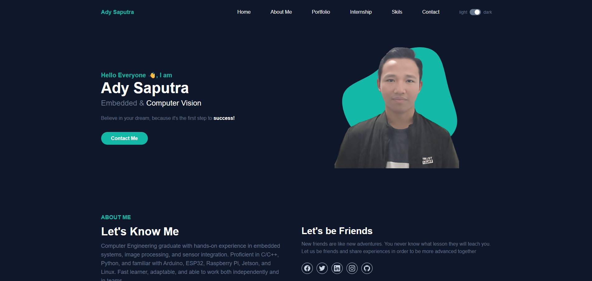
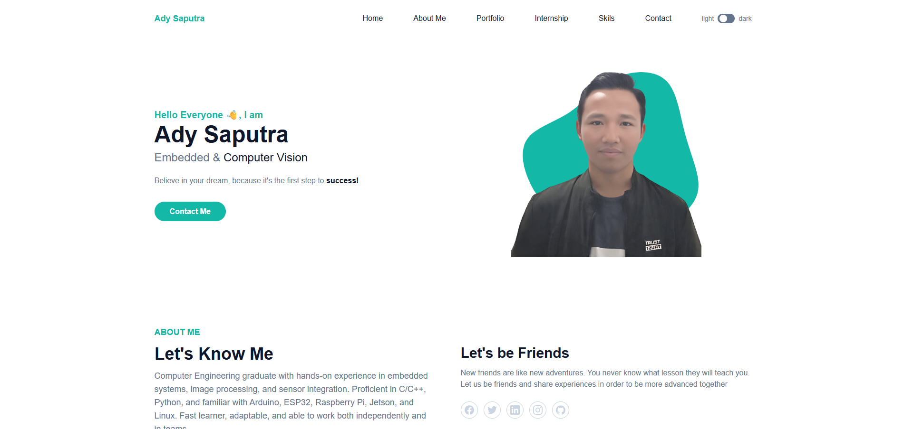
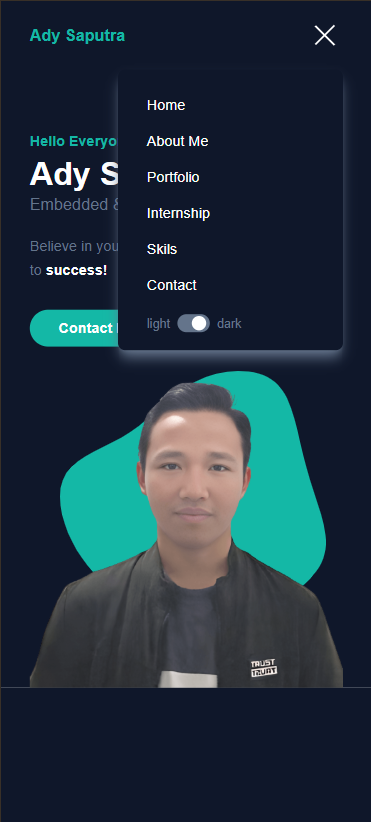
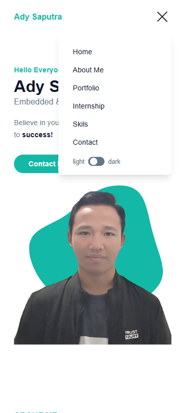

# PERSONAL PORTOFOLIO WEBSITE

## Description
A personal portfolio website designed to showcase personal information, experience, projects, and contact details, featuring a modern, responsive, and easy-to-navigate design.

## ⚙️ Technologies Used
- HTML5 — page structure
- Tailwind CSS — responsive and modern styling
- JavaScript — interactivity (dark/light buttons, menu icons, etc.)

## ✨ Features
- Responsive design
- Light/dark mode
- Profile display with banner & vision-mission
- User name greeting
- Inter-page navigation

## 🤖 AI Support Explanation
AI is used to help compile documentation content and improve efficiency in front-end development. With the help of AI, this portfolio website has become more responsive and user-friendly, as it features dark and light modes on pages that can be customized by visitors.

## 📚 Documentation
- Dekstop view
  

  
- Mobile view

